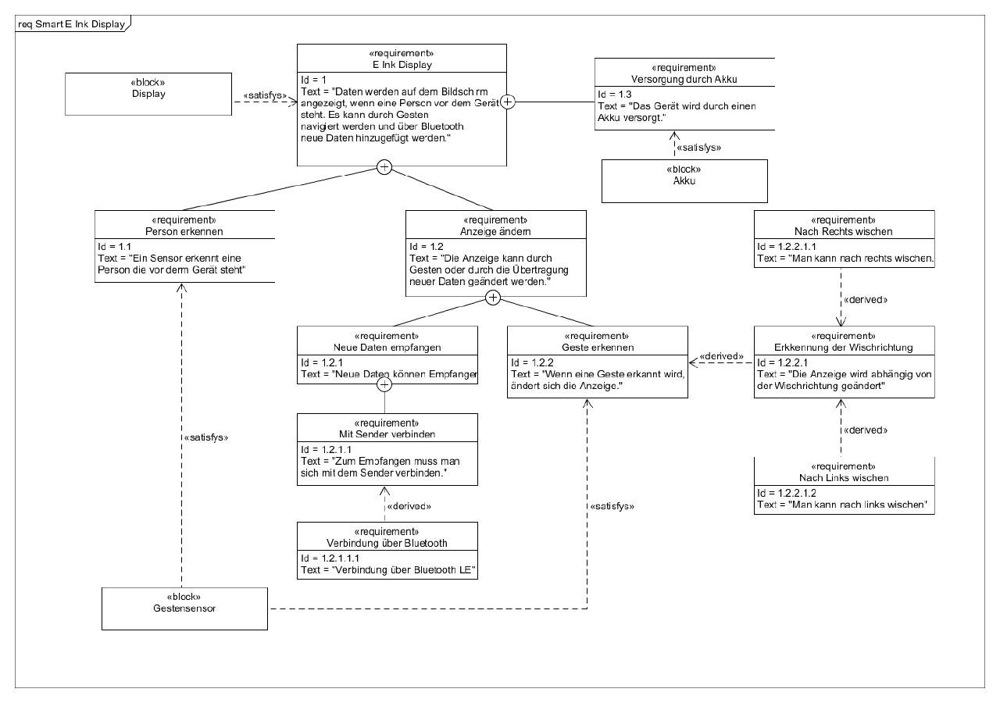

# Smart E-Ink Display:

## Introduction:

### The Display:

The device is capable of receiving images via bluetooth low-energy and store up to three images on the device. With a gesture sensor you can navigate through the stored images. 

### The App:

The images can be send and created with a specific android app. In the app you can change the background and text color, add text or draw by hand on the canvas. 

### Supported Devices: 

For BLE your smartphone needs at least Android 6.0. Other Versions will get errors.

### Installation Guide: 

Before you install the App make sure you have enabled third-party apps on your smartphone. Then download the APK and transfer it to your device and install it. After it's installed the app is ready to work. 

### Need more help with the App? 

Check our [guide](app-guide.mdl)!

## Requirements: 

## Documentation: 

[Documentation of Controller](board.md)

[Documentation of App](app.md)

## Features that are not included: 

* If nobody is standing in front of the display the device will not go in sleep mode, because after awaking from sleep mode the device resets itself and the stored images are gone.

## Future Updates / Changes:

* It takes about 10 - 15 minutes to transmit an image from the smartphone to the display. In the future we will try to get this process faster.

## Team

* Marc Schwettmann 

* Pascal Turon

