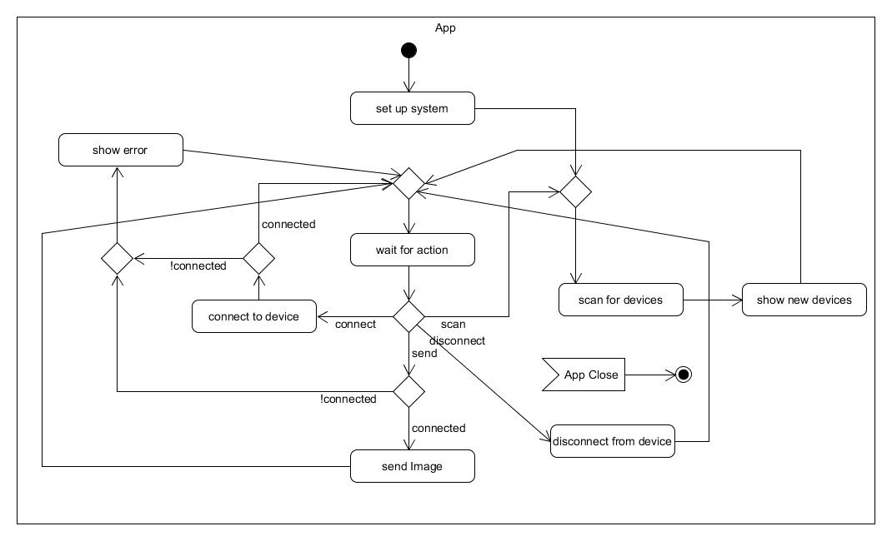

# E-Ink Connect App: 

With this app you can create and send images via ble to the e-ink display.

The app ist build with the [ionic framework](https://www.ionicframework.com) to create android and ios apps.

Need help using the app? Check our [guide](app-guide.md)!

## Used  Native APIs: 

* [BLE](https://ionicframework.com/docs/native/ble/) - sending images
* [Status Bar](https://ionicframework.com/docs/native/status-bar/) - showing the native status bar on top

## Features: 

* Scanning for devices
* Connect to device 
* Create Images: 
  * Change background color
  * Change font color 
  * Write text on canvas 
  * Draw by hand on canvas 
* Send image to device 

## Activity - Diagram:

## Documentation

[Here](app-source.md) you can find our source code.

## 
